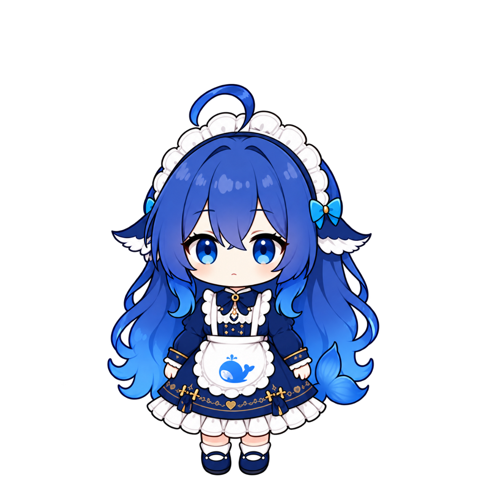

# WhalePet · 小鲸鱼桌宠

一只陪你工作的小鲸：会眨眼、呼吸，也会在被拎住短尾巴时倒挂，随着鼠标移动摇摇晃晃 AuA。

<p align="center"></p>

## 下载与安装（Windows x64）

**[前往 Releases 下载朋友分享版 ZIP](https://github.com/552528583benson-cmyk/Whalepet_V1.0/releases/latest)**

1. 下载 Release 附件 `WhalePet-Friends-20260920.zip`，不要选择 GitHub 自动生成的 Source code ZIP。
2. 完整解压，然后双击 **安装 WhalePet.exe**。
3. 安装器会创建带小鲸头像的桌面快捷方式，以后双击它启动。

自带运行环境，无需安装 Node.js，也不需要购买 API。已有旧版请先右键退出再安装。安装完成后可删除下载包和解压目录。

这是未签名的个人作品；Windows 可能提示未知发布者。请只运行可信来源的文件，不要关闭系统安全保护。

## 玩法

| 操作 | 功能 |
| --- | --- |
| 鼠标拖动 | 拎尾倒挂，按移动速度产生惯性摆动 |
| 松手 | 回到正常姿势，不累计向右下偏移 |
| 单击 | 小小的互动反应 |
| 右键 → 小鲸的控制室 | 65%–150% 缩放、自定义各状态图片、微动作与 AI 接入 |
| Ctrl + Alt + W | 移回安全角落 |
| Ctrl + Alt + H | 隐藏 / 显示 |
| Ctrl + Alt + P | 切换状态来源 |

包含 12 个高清工作姿势、透明背景、短尾倒挂与小尺寸稳定显示。自定义图片应自带透明背景；导入功能不会自动抠图。

## AI 跟随的范围

- 默认可跟随**本机 Codex**新增任务事件，映射思考、阅读、工具调用、工作、检查、生成、等待、完成等状态。
- **不自动跟随 ChatGPT 网页或普通 ChatGPT 桌面客户端。**其他 AI 需要通过本机状态桥发送事件；修改名称不等于建立连接。
- Codex 适配器基于本地事件记录，属于尽力兼容适配，不是官方稳定接口；可在右键菜单关闭。
- 没有 AI 接入时，仍可当普通桌宠使用或手动预览姿势。

详细接入、隐私和诊断说明见 [PROVIDER_INTEGRATION.md](PROVIDER_INTEGRATION.md)。应用不需要上传聊天内容，也不携带作者的聊天记录、运行状态或个人设置。

## 从源码运行

需要 Windows x64、Node.js 22.12+ 和 npm：

```powershell
npm ci
npm start
```

```powershell
npm run check
npm run test:drag
npm run test:motion
npm run test:physics
npm run test:rapid-drag
npm run test:settings
```

图形测试会打开隔离的测试实例，输出到已忽略的 `work/`，不会使用作者的个人运行状态。

制作分享包（PowerShell 7，Windows 内置 .NET Framework C# 编译器）：

```powershell
pwsh -File tools/build-friends.ps1 -ReleaseName WhalePet-Friends-20260920
```

脚本拒绝覆盖同名产物；重新构建请使用新的日期名称。下载发行包与当前源码内部版本均为 `0.15.1`。

## 素材与参考

角色素材是本项目经用户确认的 AI 辅助原创设计，高清图与倒挂姿势随源码提供；没有打包其他桌宠的角色图。见 [素材说明](ASSET_ATTRIBUTION.md) 与 [工程参考](THIRD_PARTY_REFERENCES.md)。

第三方许可保留在 `LICENSES/`；这些许可只适用于对应第三方内容，不代表给整个项目新增统一许可。
